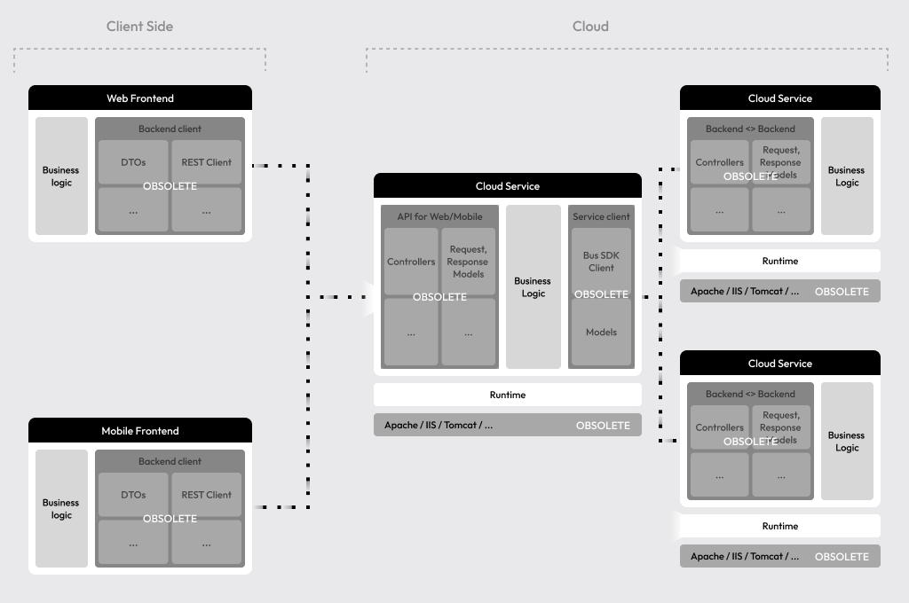
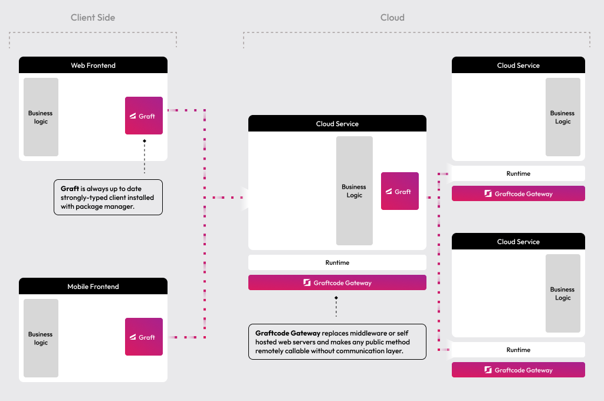

**Graftcode allows you to connect frontends, mobile apps, and backend services seamlessly, removing the overhead of APIs, SDK generation, and client maintenance.**

Instead of writing REST endpoints, gRPC protobufs, DTOs, or client layers, you just:
- **Write** any public methods.
- **Install** auto-generated, strongly-typed client using regular package manager command.
- **Call** remote methods like local dependency.

Behind the scenes, communication is handled through our Hypertube(TM) protocol, which uses native runtime integration and binary messaging. In benchmark scenarios, it processes calls up to 70% faster than traditional WebServices and significantly faster than gRPC, while typically requiring 30 to 60% less code, and keeping your business logic fully decoupled. You can read more about performance and how we measured it in **[Compare Performance](https://academy.dev.graftcode.com/documentation?section=docs%2Fperformance-and-efficiency%2Fcompare-performance.md)**.

> Start with the short intro video below to see Graftcode in action:

<iframe src="https://share.descript.com/embed/xDrYh06ZJfd" width="640" height="360" frameborder="0" allowfullscreen></iframe>

## How it Fits Your Project

Diagrams below show how Graftcode fits into standard software project and changes your current landscape:

**Graftcode changes the integration story from:**
- implement controllers
- implement request/response DTOs
- forward calls to business logic
- implement client
- parse responses to local DTOs/models
- invoke methods on client
- monitor for changes
- keep updating each layer with each update

**To:**
- expose public methods on business logic or simple plain object facades
- import entire service with package manager as direct dependency (that we call **Graft**) - strongly-typed and  always in sync client.

**Now check how clean becomes your system design with Graftcode**, so you can focus purely on business logic:

**Graftcode removes need for all previosuly required communication code both on client and service side**. Same approach works for  frontends and between microservices in your cloud. To make any public method callable just replace your middleware (Self-hosted webservice/IIS/Tomcat/Apache) with **Graftcode Gateway** (our multi-runtime host). 

> 💡 **Tip:** It is not hiding REST or gRPC behind generated wrapper code. It is replacing it with direct runtime integration based on binary communication connecting directly to target runtime native-layer ensuring highest reliability and unbeatable performance.

As **Graftcode works across all major programming languages runtimes** both remotely as well as within **single process**, you can also leverage the best libraries from any ecosystem, including Python, Java, C#, Node.js, Perl, PHP, Ruby and Go, without complex interop and mix them in one app or service. 

This allows you to build applications faster, decouple from integration logic, iterate quickly, and scale seamlessly even changing between monolith and microservices architectures with just configuration change.

## 

<collapsible title="❓ What We Hear From Early Adopters">

- **Ship features faster.** Backend client auto delivered as _strongly-typed, always up-to-date dependency_ simplifies changes and reduces bugs.
- **Less code to maintain.** Lack of controllers, DTOs, REST/gRPC clients, and SDKs reduces up to ~30%-60% of code and fully decouples app from the way how components will be connected.
- **Vibe-coding Friendly** Language models can now focus on business logic waiving narrow context window limitations.
- **Higher performance.** Native runtime communication delivers multi-x speedups (often 1.5×–10× vs REST/gRPC, network-dependent) lowering latency and increasing throughput.
- **Lower cloud costs.** Faster integrations mean less CPU time, and smaller payload-direct savings on compute, networking, and PaaS messaging and queueing.
- **Production agility.** Now you can change communication channel or extract modules as separate microservices as well as merge it back as monolith without code change.
- **Cleaner architecture.** Remove the integration layer between frontends and services/microservices; fewer moving parts and code to design, develop and maintain.
- **Fits current standards.** Graftcode is fully compatible with standard monitoring, observability and security practices. It just replaces the way developer intent is expressed and format of communication but uses standard TCP/IP TLS or WebSocket Secure and can be routed through any API Managers, gateways, load balancers and proxies.
- **Polyglot freedom.** With multi-runtime hosting capability and connection on native level you can mix programming languages per service and reuse best-in-class libraries across Python, Java, C#, Node.js, Go, PHP, Ruby, Perl without complex interop.
- **Intuitive Effortless Migration.** Migrate existing projects just running your services on Graftcode gateway, adding Graft to client and switching at least one api client call to try and next quickly scale to all.
- **Run anywhere.** Graftcode works across all major programming languages and platforms-cloud, browser, mobile. It can host logic within containers, PaaS services or on local machines.

</collapsible>

Let's see this in action through a real-world demo.
