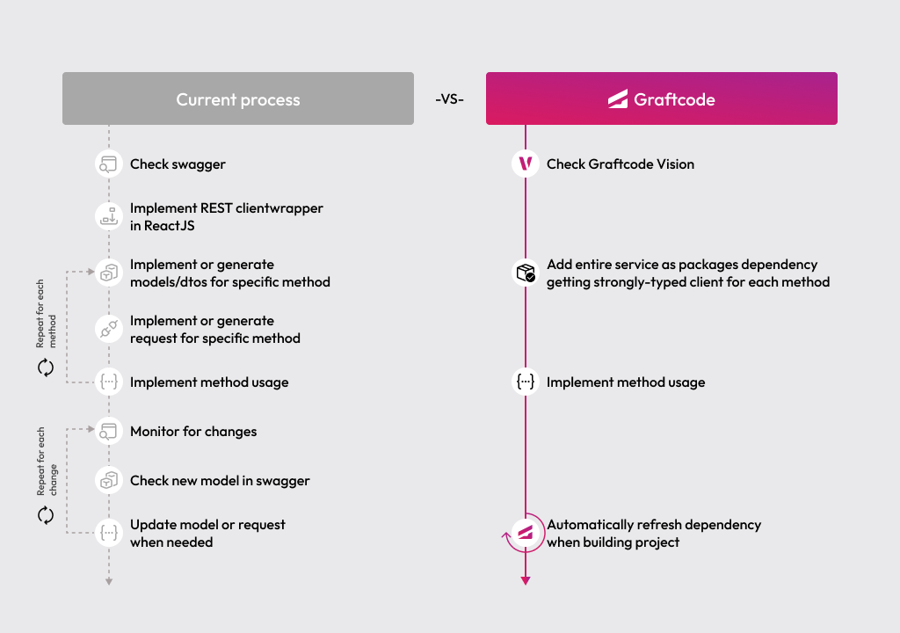

## Goal

Connect an Astro app to backend logic with Graftcode - no REST clients, no DTOs, no handwritten integration code.

### What You'll See

- Install a typed Graft from a live backend service instead of writing REST client code.
- Configure the generated client to point at a sample backend server.
- Call a backend method directly from an Astro client island as if it were local code.
- Use IDE autocompletion on backend methods and types - powered by the installed Graft package.

### Prerequisites

- [Node.js](https://nodejs.org/) installed locally

## Step 1. Start with an Astro app

This gives you a working Astro app where you can add your first Graft.

```bash
git clone https://github.com/grft-dev/astro-hello-world
cd astro-hello-world
npm install
```

## Step 2. Open the backend in Graftcode Vision

Before you install anything, compare the two views of the same backend:

- [Swagger](https://g-d-ca-polc-demo-ecws-01.nicedesert-fa74799d.polandcentral.azurecontainerapps.io/swagger/index.html) shows routes, verbs, and payloads.
- [Graftcode Vision](https://g-d-ca-polc-demo-ecbe-01.nicedesert-fa74799d.polandcentral.azurecontainerapps.io) shows public classes and methods and gives you the package manager command to install them.

This is the key Graftcode shift: instead of reading an API spec and building a client, you install the service as a dependency and call methods directly.

## Step 3. Install the Graft

Open [Graftcode Vision](https://g-d-ca-polc-demo-ecbe-01.nicedesert-fa74799d.polandcentral.azurecontainerapps.io), pick `npm`, and copy the generated install command.

```bash
npm install --registry https://grft.dev/11ee1b4f-1a87-4b7d-9112-1ada3ad69b9e__free @graft/nuget-energypriceservice@1.3.0
```

The command above is a snapshot for this guide. The registry UUID and package version can change - always prefer the install command currently shown in Graftcode Vision.

## Step 4. Configure the generated client

Open `src/components/Bill.jsx` and connect the generated client to the service host. The exact configuration snippet for your language is available in [Graftcode Vision](https://g-d-ca-polc-demo-ecbe-01.nicedesert-fa74799d.polandcentral.azurecontainerapps.io) under the **Configuration** installation tab:

```javascript
import { useEffect, useState } from "react";
import { BillingLogic, GraftConfig } from "@graft/nuget-energypriceservice";

GraftConfig.host = "wss://g-d-ca-polc-demo-ecbe-01.nicedesert-fa74799d.polandcentral.azurecontainerapps.io/ws";
```

`@graft/nuget-energypriceservice` is the Graft you installed - it exposes the backend's public classes and methods as normal JavaScript imports. Setting `GraftConfig.host` tells the client where the backend is running.

Astro renders pages on the server. The Graft client talks to the backend over a WebSocket, so keep the import and the method call inside a client island. This starter already mounts `Bill` with `client:load` in `src/pages/index.astro`:

```astro
---
import Bill from "../components/Bill.jsx";
---

<html lang="en">
  <head>
    <meta charset="utf-8" />
    <meta name="viewport" content="width=device-width" />
    <title>Astro Hello World</title>
  </head>
  <body>
    <Bill client:load />
  </body>
</html>
```

`client:load` hydrates the React island in the browser. Do not import `@graft/nuget-energypriceservice` from an `.astro` frontmatter block.

## Step 5. Call a backend method

`BillingLogic` is a class from the backend, and `calculateMonthlyBill(...)` is one of its public methods - the same ones you browsed in Graftcode Vision. The npm Graft uses **camelCase** method names even when the backend or Vision shows PascalCase from C#. You call it like any other imported function.

```javascript
import { useEffect, useState } from "react";
import { BillingLogic, GraftConfig } from "@graft/nuget-energypriceservice";

GraftConfig.host = "wss://g-d-ca-polc-demo-ecbe-01.nicedesert-fa74799d.polandcentral.azurecontainerapps.io/ws";

export default function Bill() {
  const [data, setData] = useState(null);

  useEffect(() => {
    BillingLogic.calculateMonthlyBill(88.4, 1.4, 23).then(setData);
  }, []);

  return <h1>Calculated Energy Monthly Bill is: {data?.toFixed(2)}</h1>;
}
```

## Step 6. Run the app

Start the development server:

```bash
npm run dev
```

In this starter, `npm run dev` runs Astro. Open the URL shown in the terminal (typically [http://localhost:4321](http://localhost:4321)). You should see the calculated energy bill rendered on the page.

If something is not working, expand below to see the full `src/components/Bill.jsx` source:

<collapsible title="Full src/components/Bill.jsx code">

```javascript
import { useEffect, useState } from "react";
import { BillingLogic, GraftConfig } from "@graft/nuget-energypriceservice";

GraftConfig.host = "wss://g-d-ca-polc-demo-ecbe-01.nicedesert-fa74799d.polandcentral.azurecontainerapps.io/ws";

export default function Bill() {
  const [data, setData] = useState(null);

  useEffect(() => {
    BillingLogic.calculateMonthlyBill(88.4, 1.4, 23).then(setData);
  }, []);

  return <h1>Calculated Energy Monthly Bill is: {data?.toFixed(2)}</h1>;
}
```

</collapsible>

## Step 7. Explore more methods and keep up with backend changes

Go back to [Graftcode Vision](https://g-d-ca-polc-demo-ecbe-01.nicedesert-fa74799d.polandcentral.azurecontainerapps.io) to inspect more methods on `BillingLogic`.

Your IDE can autocomplete available methods and arguments because the service is installed as a typed package, not consumed through handwritten API code. Your AI can now generate frontend code using backend methods as easily as using other npm modules you imported.

When the backend evolves - new methods, changed signatures, updated types - the Graft package version updates just like any other npm package. You see the change in your `package.json`, update with a single command, and your IDE immediately reflects the new API surface:

```bash
npm update @graft/nuget-energypriceservice
```

No need to regenerate clients, rewrite fetch calls, or re-sync OpenAPI specs. Backend changes flow through the same package manager workflow you already use for every other dependency.

<collapsible title="Old Way vs New Way">

### Without Graftcode

Connecting a frontend to a backend typically requires:

- Designing REST or GraphQL endpoints on the backend for every operation
- Defining request and response DTOs and validation logic
- Generating or hand-writing a client SDK for the frontend
- Mapping API responses back to frontend types manually
- Updating and re-testing the client every time the backend changes
- Maintaining separate documentation or OpenAPI specs for the API contract

### With Graftcode

- Install the backend as a strongly-typed Graft via `npm install`
- Import classes and call methods directly from your Astro client islands
- When the backend changes, update the Graft with a single `npm install` command - no client rewrites

> With Graftcode, connecting an Astro frontend to any backend is as simple as installing an npm package. No REST clients, no DTOs, no contract maintenance - just import and call.



</collapsible>
