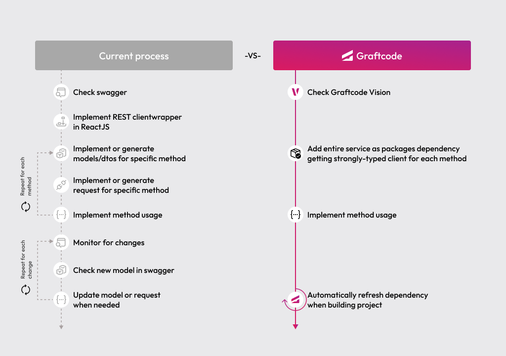

## Goal

Connect a React app to backend logic with Graftcode - no REST clients, no DTOs, no handwritten integration code.

### What You'll See

- Install a typed Graft from a live backend service instead of writing REST client code.
- Configure the generated client to point at a sample backend server.
- Call a backend method directly from a React component as if it were local code.
- Use IDE autocompletion on backend methods and types - powered by the installed Graft package.

### Prerequisites

- [Node.js](https://nodejs.org/) installed locally

## Step 1. Start with a React app

This gives you a working React app where you can add your first Graft.

```bash
git clone https://github.com/grft-dev/react-hello-world
cd react-hello-world
npm install
```

## Step 2. Open the backend in Graftcode Vision

Before you install anything, compare the two views of the same backend:

- [Swagger](https://gc-d-ca-polc-demo-ecws-01.blackgrass-d2c29aae.polandcentral.azurecontainerapps.io/swagger/index.html) shows routes, verbs, and payloads.
- [Graftcode Vision](https://gc-d-ca-polc-demo-ecbe-01.blackgrass-d2c29aae.polandcentral.azurecontainerapps.io) shows public classes and methods and gives you the package manager command to install them.

This is the key Graftcode shift: instead of reading an API spec and building a client, you install the service as a dependency and call methods directly.

## Step 3. Install the Graft

Open Graftcode Vision, pick `npm`, and copy the generated install command.

`javonet-nodejs-sdk` is still required for this example today, but that extra step is temporary.

```bash
npm install javonet-nodejs-sdk
npm install --registry https://grft.dev/4b4e411f-60a0-4868-b8a6-46f5dee07448__free @graft/nuget-energypriceservice@1.2.0
```

## Step 4. Configure the generated client

Open `src/App.jsx` and connect the generated client to the service host:

```javascript
import { useEffect, useState } from "react";
import { BillingLogic, GraftConfig } from "@graft/nuget-energypriceservice";

GraftConfig.host = "wss://gc-d-ca-polc-demo-ecbe-01.blackgrass-d2c29aae.polandcentral.azurecontainerapps.io/ws";
```

`@graft/nuget-energypriceservice` is the Graft you installed - it exposes the backend's public classes and methods as normal JavaScript imports. Setting `GraftConfig.host` tells the client where the backend is running.

## Step 5. Call a backend method

```javascript
function App() {
  const [data, setData] = useState(null);

  useEffect(() => {
    BillingLogic.CalculateMonthlyBill(88.4, 1.4, 23).then(setData);
  }, []);

  return <h1>Calculated Energy Monthly Bill is: {data?.toFixed(2)}</h1>;
}

export default App;
```

`BillingLogic.CalculateMonthlyBill(...)` is a backend call, but in your code it feels like a normal dependency.

## Step 6. Run the app

Start the development server:

```bash
npm run dev
```

Open the URL shown in the terminal (typically [http://localhost:5173](http://localhost:5173)). You should see the calculated energy bill rendered on the page.

## Step 7. Explore more methods and keep up with backend changes

Go back to [Graftcode Vision](https://gc-d-ca-polc-demo-ecbe-01.blackgrass-d2c29aae.polandcentral.azurecontainerapps.io) to inspect more methods on `BillingLogic`. 

Your IDE can autocomplete available methods and arguments because the service is installed as a typed package, not consumed through handwritten API code. Your AI can now generate frontend code using backend methods as easily as using other npm modules you imported.

When the backend evolves - new methods, changed signatures, updated types - the Graft package version updates just like any other npm package. You see the change in your `package.json`, update with a single command, and your IDE immediately reflects the new API surface:

```bash
npm update @graft/nuget-energypriceservice
```

No need to regenerate clients, rewrite fetch calls, or re-sync OpenAPI specs. Backend changes flow through the same package manager workflow you already use for every other dependency.

## Old Way vs New Way

### Without Graftcode

Connecting a frontend to a backend typically requires:

- Designing REST or GraphQL endpoints on the backend for every operation
- Defining request and response DTOs and validation logic
- Generating or hand-writing a client SDK for the frontend
- Mapping API responses back to frontend types manually
- Updating and re-testing the client every time the backend changes
- Maintaining separate documentation or OpenAPI specs for the API contract

### With Graftcode

- Install the backend as a strongly-typed Graft via `npm install`
- Import classes and call methods directly from your React components
- When the backend changes, update the Graft with a single `npm install` command - no client rewrites

> With Graftcode, connecting a React frontend to any backend is as simple as installing an npm package. No REST clients, no DTOs, no contract maintenance - just import and call.

