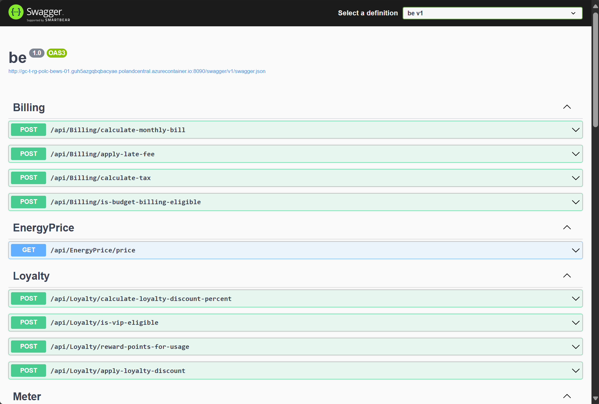
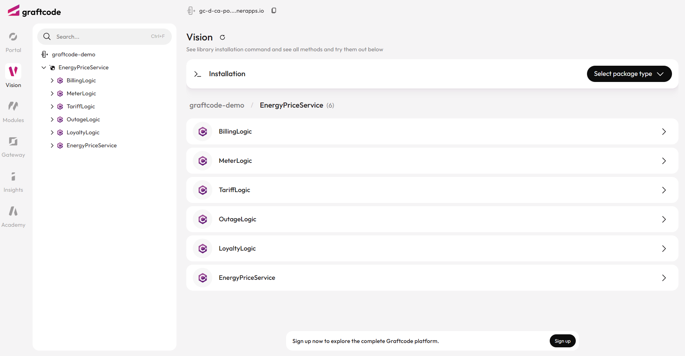
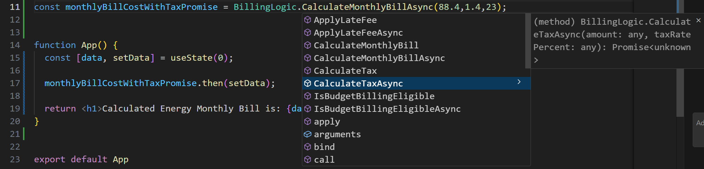

## Goal

Learn how to connect a React frontend to backend logic with Graftcode by installing a stronlgy-typed Graft, importing the generated client, and calling backend methods directly from your app.

### What You'll See

- Clone a starter React app.
- Install a Graft (strongly-typed client) from a live backend service using npm.
- Import and call backend methods directly in your React component.

## Step 1. Create Fresh React App

```bash
git clone https://github.com/grft-dev/react-hello-world
```

Clone the starter React app that we'll use in this quick start.

## Step 2. Open the project in VS Code

```bash
cd react-hello-world
code .
```

Move into the project folder and open it in your editor.

## Step 3. Install dependencies and run the app

```bash
npm install
npm run dev
```

Install the project dependencies and start the development server.

Now we're ready to add your first Graft.

## Step 4. View the backend service

Before calling backend service, let's see how it looks like. We prepared it in both old REST based approach and one exposed with Graftcode.

- [With REST in Swagger](http://gc-d-ca-polc-demo-ecws-01.blackgrass-d2c29aae.polandcentral.azurecontainerapps.io:8090/swagger/index.html), you'll see a list of endpoints - raw routes, HTTP verbs, and payloads.

- [With Graftcode in Vision Portal](https://gc-d-ca-polc-demo-ecbe-01.blackgrass-d2c29aae.polandcentral.azurecontainerapps.io), you'll see the same backend but exposed as regular classes and methods + package manager command to install it as dependency in any technology.




Graftcode Vision lets you browse the public classes and methods exposed by a service. It also gives you the package manager command that will provide a strongly-typed interface to this service.

With Swagger, the usual flow is: read the API spec, generate or write a client, map requests and responses, then maintain that integration over time.

With Graftcode, the flow is simpler: install Graft with one command and call its public methods directly in your app, getting notifications about updates, if the backend changes.

## Step 5. Add First Graft

```bash
npm install javonet-nodejs-sdk
npm install --registry https://grft.dev/4b4e411f-60a0-4868-b8a6-46f5dee07448__free @graft/nuget-energypriceservice@1.2.0
```

Let's add our first Graft.

Open Graft Vision, choose your preferred package manager from the dropdown, and copy the generated command into your terminal.

Since this quick start uses a React app, select npm.

At the moment, installing `javonet-nodejs-sdk` is also required. This extra step is temporary and will be removed in a future update.

> This command installs a Graft - a generated package that exposes strongly-typed classes and methods, allowing you to call external services as if they were part of your local codebase.

## Step 6. Import and configure the backend client

```javascript
import { useState } from "react";
import { GraftConfig, BillingLogic } from '@graft/nuget-EnergyPriceService';

GraftConfig.host="wss://gc-d-ca-polc-demo-ecbe-01.blackgrass-d2c29aae.polandcentral.azurecontainerapps.io/ws";

function App() {
  
}

export default App
```

Open src\App.jsx, import the generated Graft client and set up a connection to the backend service by copying the code from Graftcode Vision.

The client exposes the public classes and methods provided by the selected service, so you can use them directly in your frontend code.

## Step 7. Call your first backend method

```javascript
import { useState } from "react";
import { GraftConfig, BillingLogic } from '@graft/nuget-EnergyPriceService';

GraftConfig.host="wss://gc-d-ca-polc-demo-ecbe-01.blackgrass-d2c29aae.polandcentral.azurecontainerapps.io/ws";

const monthlyBillCostWithTaxPromise = BillingLogic.CalculateMonthlyBill(88.4, 1.4, 23);

function App() {
  
}

export default App
```

Now call one of the public methods exposed by the backend client.

## Step 8. Display the result in React

```javascript
import { useState } from "react";
import { GraftConfig, BillingLogic } from '@graft/nuget-EnergyPriceService';

GraftConfig.host="wss://gc-d-ca-polc-demo-ecbe-01.blackgrass-d2c29aae.polandcentral.azurecontainerapps.io/ws";

const monthlyBillCostWithTaxPromise = BillingLogic.CalculateMonthlyBill(88.4, 1.4, 23);

function App() {
  const [data, setData] = useState(0);

  monthlyBillCostWithTaxPromise.then(setData);

  return <h1>Calculated Energy Monthly Bill is: {data.toFixed(2)}</h1>;
}

export default App
```

Now use the backend client inside your React component and store the returned value in component state.

Once the method call completes, render the result in the UI to confirm that your app is connected to the backend through the installed Graft.

## Step 9. Run the app to see the results

```bash
npm run dev
```

Start the React development server and open the app in your browser.

If everything is configured correctly, you should see the result returned by the backend method rendered in the UI.

## Step 10. Explore more methods in Graftcode Vision

Try calling more async methods from the backend, for example from the `BillingLogic` class.

Notice how your IDE provides auto-completion and type checking for every method and argument.



> There is no need to build REST or gRPC clients, maintain DTOs, or map models manually - with Graftcode, you call backend functionality directly through a strongly-typed dependency.

## Step 11. Compare old-way vs new-way

Check this chart to understand how your daily integration process will change with Graftcode:


> ⚡ **Important:** Think how much time you saved. Normally, you would need to generate or hand-write client code from Swagger/OpenAPI, maintain models/DTOs and routes for every method. With Graftcode, it's just one command and a method call to any function regardless of service complexity. There is no need to monitor for changes or manually update across multiple layers. Everything stays in sync and typed checked interface validates methods usage at compile time. If the interface changes are evolutionary your Graft will keep working even if you do not decide to update to latest state.
