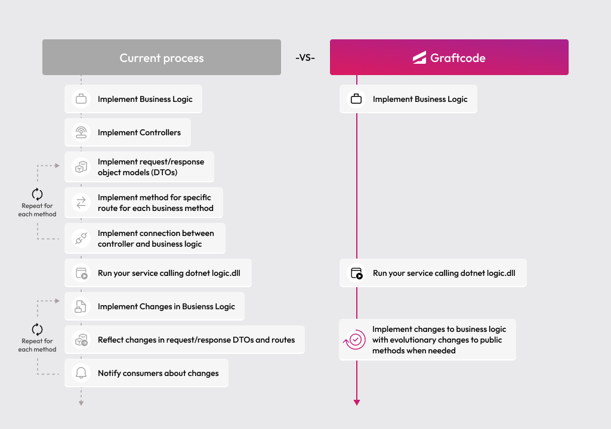

## Goal

Connect a Java backend service to another remote service using Graftcode - so the remote integration stays strongly typed and reads like a normal method call.

### What You'll See

- Install a remote service as a strongly-typed Graft via Maven.
- Configure the generated client to point at the remote host.
- Call a remote method from your own service logic as if it were a local class.
- Use IDE autocompletion on the remote service's methods and classes.

### Prerequisites

- [Docker](https://docs.docker.com/get-docker/) installed and running
- [JDK 21](https://adoptium.net/) and [Maven](https://maven.apache.org/download.cgi) installed locally

## Step 1. Create a Java service

Create a new project folder for your backend service:

```bash
mkdir java-energy-consumer
cd java-energy-consumer
```

## Step 2. Find the remote method in Graftcode Vision

Open the hosted [Graftcode Vision](https://gc-d-ca-polc-demo-ecbe-01.blackgrass-d2c29aae.polandcentral.azurecontainerapps.io) portal.

Graftcode Vision shows all public classes and methods exposed by the remote service - their names, parameter types, and return types. It also gives you the exact package manager command needed to install that service as a Graft.

## Step 3. Install the Graft

Open Graftcode Vision, pick `Maven`, and copy the generated dependency coordinates.

`javonet-java-sdk` is still required for this example today, but that extra step is temporary.

Create a `pom.xml` with the Graft dependency and the Graftcode repository:

```xml
<?xml version="1.0" encoding="UTF-8"?>
<project xmlns="http://maven.apache.org/POM/4.0.0"
         xmlns:xsi="http://www.w3.org/2001/XMLSchema-instance"
         xsi:schemaLocation="http://maven.apache.org/POM/4.0.0
                             http://maven.apache.org/xsd/maven-4.0.0.xsd">
    <modelVersion>4.0.0</modelVersion>

    <groupId>com.example</groupId>
    <artifactId>energy-consumer</artifactId>
    <version>1.0.0</version>

    <properties>
        <maven.compiler.source>21</maven.compiler.source>
        <maven.compiler.target>21</maven.compiler.target>
        <project.build.sourceEncoding>UTF-8</project.build.sourceEncoding>
    </properties>

    <repositories>
        <repository>
            <id>graftcode</id>
            <url>https://grft.dev/4b4e411f-60a0-4868-b8a6-46f5dee07448__free/maven</url>
        </repository>
    </repositories>

    <dependencies>
        <dependency>
            <groupId>com.javonet</groupId>
            <artifactId>javonet-java-sdk</artifactId>
            <version>2.5.0</version>
        </dependency>
        <dependency>
            <groupId>com.graft.nuget</groupId>
            <artifactId>energypriceservice</artifactId>
            <version>1.2.0</version>
        </dependency>
    </dependencies>

    <build>
        <plugins>
            <plugin>
                <groupId>org.codehaus.mojo</groupId>
                <artifactId>exec-maven-plugin</artifactId>
                <version>3.5.0</version>
                <configuration>
                    <mainClass>energy.Main</mainClass>
                </configuration>
            </plugin>
        </plugins>
    </build>
</project>
```

This adds the generated strongly-typed client for the remote service to your project.

## Step 4. Call the remote method and run it

Create `src/main/java/energy/Main.java`:

```java
package energy;

import com.graft.nuget.energypriceservice.GraftConfig;
import com.graft.nuget.energypriceservice.MeterLogic;

public class Main {
    public static void main(String[] args) throws Exception {
        GraftConfig.host = "wss://gc-d-ca-polc-demo-ecbe-01.blackgrass-d2c29aae.polandcentral.azurecontainerapps.io/ws";

        var consumption = MeterLogic.NetConsumptionKWh(1000, 1150);
        System.out.println("Net consumption: " + consumption);
    }
}
```

Run it:

```bash
mvn compile exec:java
```

You should see the net consumption value printed in your terminal. `MeterLogic.NetConsumptionKWh(...)` is a remote call, but your code reads like a normal method invocation - no HTTP request, no response parsing, no serialization.

Your IDE can autocomplete available methods on `MeterLogic`, `BillingLogic`, and any other class from that service because the Graft is a real Maven dependency.

## Step 5. Run with a Project Key (recommended for real-world usage)

Everything above works without any account - perfect for learning and local development. When you're ready for real-world usage, create a free account at [portal.graftcode.com](https://portal.graftcode.com), set up a project, and copy its **Project Key**.

With a Project Key, point `GraftConfig.host` at your project's stable registry URL instead of a raw WebSocket address. A Project Key gives you:

- **Stable registry URL** - the address for your Grafts stays permanent, so install commands don't change when you redeploy.
- **Portal visibility** - see all your gateways and services in one place at [gateways.graftcode.com](https://gateways.graftcode.com/).
- **Access control** - decide who can download your Grafts using package manager authentication and permissions.

## Old Way vs New Way

### Without Graftcode

Connecting one backend service to another typically requires:

- Designing and implementing REST or gRPC endpoints in the remote service
- Defining request/response DTOs for every operation
- Writing or generating an OpenAPI or Protobuf spec
- Building or generating a client SDK in the consuming service's language
- Manually keeping both sides in sync when signatures change
- Adding error handling, retry logic, and serialization code

### With Graftcode

- Install the remote service as a strongly-typed Graft via Maven
- Import its classes and call methods directly - no REST client code
- When the remote service changes, update with one command - like any other dependency

> Connecting two backend services with Graftcode is as simple as adding a Maven dependency. No REST routes, no DTOs, no client generation - just import and call.


