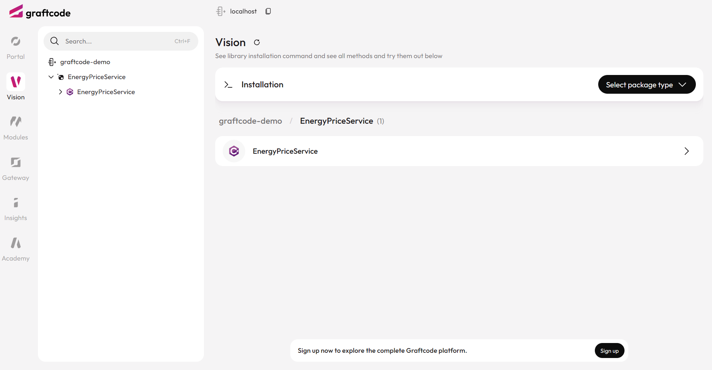

## Goal

Turn a simple project into a remotely callable service using Graftcode Gateway - no controllers, no REST routes, no OpenAPI specs.


### What You'll See

- Clone a simple .NET library with a public method.
- Expose it through Graftcode Gateway using a single Dockerfile.
- Get a Graftcode Vision portal with all public methods discoverable and callable from any language.

## Step 1. Clone the .NET backend service

Start by getting a simple .NET service that we'll expose through Graftcode Gateway. 

```bash
git clone https://github.com/grft-dev/dotnet-energy-price-service.git
cd dotnet-energy-price-service
code .
```

This is a minimal .NET library. Just a class with a public static method:

```csharp
namespace MyEnergyService;

public class EnergyPriceCalculator
{
    public static double GetPrice()
    {
        return new Random().Next(100, 105);
    }
}
```

## Step 2. Expose it with Graftcode Gateway

The repo already includes a Dockerfile. It installs Graftcode Gateway and passes your compiled assembly to it:

```dockerfile
FROM mcr.microsoft.com/dotnet/aspnet:9.0

WORKDIR /usr/app

RUN mkdir -p /usr/app \
 && apt-get update \
 && apt-get install -y wget \
 && wget -O /usr/app/gg.deb \
    https://github.com/grft-dev/graftcode-gateway/releases/latest/download/gg_linux_amd64.deb \
 && dpkg -i /usr/app/gg.deb \
 && rm /usr/app/gg.deb \
 && apt-get clean \
 && rm -rf /var/lib/apt/lists/*
 
# You just need to copy your binaries with public interfaces
COPY /bin/Release/net8.0/publish/ /usr/app/

EXPOSE 80
EXPOSE 81
# And run Graftcode Gateway passing name of modules that should be exposed
CMD ["gg", "--modules", "/usr/app/MyEnergyService.dll"]
```

The key line is the last one - `gg` inspects your assembly, discovers public methods, and exposes them. Port 80 handles service calls, port 81 serves Graftcode Vision.

<collapsible title="🐳 Understanding the Dockerfile - Click to see what each line does">

- **FROM mcr.microsoft.com/dotnet/aspnet:9.0** - Pulls the official Microsoft .NET ASP.NET runtime image, providing a Linux environment with the .NET 9 runtime required to execute your published service binaries.
- **RUN mkdir -p /usr/app && apt-get update && apt-get install -y wget** - Creates the application directory and installs required system tools for downloading Graftcode Gateway.
- **wget -O /usr/app/gg.deb ... && dpkg -i /usr/app/gg.deb** - Downloads and installs the latest Graftcode Gateway package, which is responsible for discovering and exposing public methods from your .NET assemblies.
- **rm /usr/app/gg.deb && apt-get clean && rm -rf /var/lib/apt/lists/** - Removes installer files and cleans package caches to reduce the final image size.
- **COPY /bin/Release/net8.0/publish/ /usr/app/** - Copies your already-published .NET service binaries into the container. Only compiled output is included, not source code.
- **EXPOSE 80** - Declares the port used for service communication.
- **EXPOSE 81** - Declares the port used by Graftcode Vision, the Swagger-like UI for exploring and testing exposed methods.
- **CMD ["gg", "--modules", "/usr/app/MyEnergyService.dll"** - Runs the Graftcode Gateway executable (gg) with your .NET module, automatically exposing your public methods as REST endpoints with Graftcode Vision UI enabled

</collapsible>

Now, let's build and run your Docker container with the following commands. Please note that you need to have Docker installed and running on your machine to execute these commands:

```bash
dotnet build .\MyEnergyService.csproj
dotnet publish .\MyEnergyService.csproj
docker build --no-cache --pull -t myenergyservice:test .
docker run -d -p 80:80 -p 81:81 --name graftcode_demo myenergyservice:test
```

## Step 3. Explore your service in Graftcode Vision

Open [http://localhost:81/GV](http://localhost:81/GV) in your browser.



You'll see all public methods exposed by your service, a "Try it out" button to call them live, and the package manager command to install this service as a Graft in any frontend or backend app.

## Step 4. Compare: old-way vs. Graftcode way

Check this chart to understand how your daily process of exposing backend logic for remote consumption will change with Graftcode:


> Your .NET method is now a fully accessible backend service - with one Dockerfile and four commands. No controllers, no DTOs, no OpenAPI spec. Any public method you add is instantly available to call from any language.
