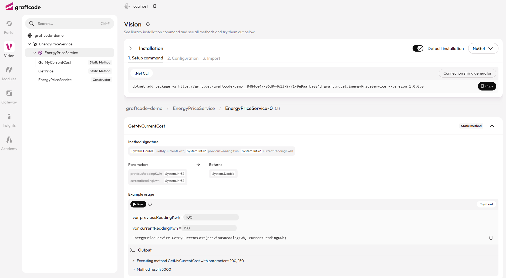

## Goal

Connect the .NET service from the previous step to another backend service using Graftcode. The integration stays strongly typed and looks like a normal method call in your code.

### What You'll See

- Install a remote service as a NuGet dependency.
- Configure the connection from your .NET service.
- Call a cloud method from your own backend code.

## Step 1. Find the method in Graftcode Vision

Open the hosted Graftcode Vision portal:

Locate `MeterLogic.NetConsumptionKWh`. This is the remote method your .NET service will call.

Graftcode Vision shows the available methods, their signatures, and the package manager command needed to install the service as a strongly-typed dependency.

## Step 2. Install the Graft with NuGet

Use the generated NuGet command:

```bash
dotnet add package -s https://grft.dev/34de0ff8-008d-4363-844b-b2e5a41c63bb__free graft.nuget.EnergyPriceService --version 1.2.0.0
```

This installs the generated client for the remote service into your .NET project.

## Step 3. Configure the connection

Open `MyEnergyService.cs` and add the Graft namespace:

```csharp
using graft.nuget.EnergyPriceService;
```

Then configure the remote host in a static constructor:

```csharp
static EnergyPriceCalculator()
{
    graft.nuget.EnergyPriceService.GraftConfig.Host = "wss://gc-d-ca-polc-demo-ecbe-01.blackgrass-d2c29aae.polandcentral.azurecontainerapps.io/ws";
}
```

## Step 4. Call the remote method

Add a new method to `EnergyPriceCalculator`:

```csharp
public static double GetMyCurrentCost(int previousReadingKwh, int currentReadingKwh)
{
    var consumption = MeterLogic.NetConsumptionKWh(previousReadingKwh, currentReadingKwh);
    return consumption * GetPrice();
}
```

This is the important part: `MeterLogic.NetConsumptionKWh(...)` is a remote call, but it looks like a normal method call in your code.


Full file:

```csharp
using graft.nuget.EnergyPriceService;

namespace MyEnergyService;

public class EnergyPriceCalculator
{
    static EnergyPriceCalculator()
    {
        graft.nuget.EnergyPriceService.GraftConfig.Host = "wss://gc-d-ca-polc-demo-ecbe-01.blackgrass-d2c29aae.polandcentral.azurecontainerapps.io/ws";
    }

    public static double GetMyCurrentCost(int previousReadingKwh, int currentReadingKwh)
    {
        var consumption = MeterLogic.NetConsumptionKWh(previousReadingKwh, currentReadingKwh);
        return consumption * GetPrice();
    }

    public static double GetPrice()
    {
        return new Random().Next(100, 105);
    }
}
```

## Step 5. Rebuild and test

Rebuild and publish the project:

```bash
dotnet build .\\MyEnergyService.csproj
dotnet publish .\\MyEnergyService.csproj
```

Rebuild the Docker image and restart the container:

```bash
docker stop graftcode_demo
docker rm graftcode_demo
docker build --no-cache --pull -t myenergyservice:test .
docker run -d -p 80:80 -p 81:81 --name graftcode_demo myenergyservice:test
```

Then open [http://localhost:81/GV](http://localhost:81/GV), find `GetMyCurrentCost`, and run it with sample values like `100` and `150`.



> This example shows that Graftcode is not just for frontend-to-backend calls. You can also use it for backend-to-backend integration, with the same strongly-typed experience and without building REST clients or mapping DTOs by hand.
