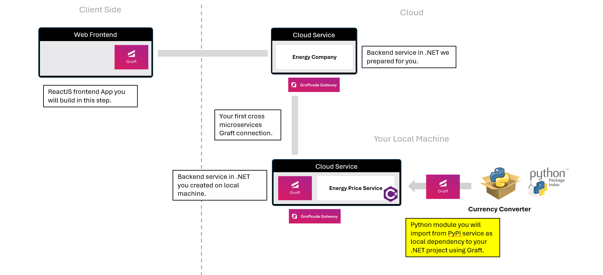

## Goal

Augment your .NET price service with **Python currency converter** and see how easily you can pick any module regardless of technology and use it as direct dependency.



## What You'll See

- Add a Python currency converter package directly into your .NET app as regular dotnet dependency using nuget.
- Call it like a local C# method in one line.

## Step 1. Add the Python currency converter package from PyPI using nuget

From your **MyEnergyService** project call this command:

```bash
dotnet add package -s https://grft.dev graft.pypi.sdncenter-currency-converter
```

This generates a **typed Graft for the Python currency converter module** - ready to call from .NET.

## Step 2. Add usage of python logic in your .NET service method that calculates current cost:

Update your code to allow providing currency to be used for calculating result. First add using to new graft:

```csharp
using graft.sdncenter_currency_converter;
```

Next add a new method __GetMyCurrentCost()__ that takes also currency argument. Remember to **Save** your file:

```csharp
    public static double GetMyCurrentCost(int previousReadingKwh, int currentReadingKwh, string currency)
    {
        var consumption = MeterLogic.NetConsumptionKWh(previousReadingKwh, currentReadingKwh);

        var convertedValue = SimpleCurrencyConverter.convert(consumption * (float)GetPrice(), "USD", currency);
        return convertedValue;
    }
```

Now your service calculates the price and converts the result to the desired currency using the Python module. Because our change was evolutionary without breaking previous method overloads, Grafts generated before will keep working even if they are no updated to latest state.

## Step 3. Build, configure and test your enhanced service

First, build and publish your project with these commands:

```bash
dotnet build .\\MyEnergyService.csproj
dotnet publish .\\MyEnergyService.csproj
```

Now rebuild and run your Docker container:

```bash
docker stop graftcode_demo
docker rm graftcode_demo

docker build --no-cache --pull -t myenergyservice:test .
docker run -d -p 80:80 -p 81:81 --name graftcode_demo myenergyservice:test
```

Now you can visit the GraftVision portal at [http://localhost:81/GV](http://localhost:81/GV)

_GetEnergyPrice.GetMyCurrentCost()_ appears automatically extended with new parameter.
You can Try it out live passing "EUR" as target currency.

## Step 4. Compare: old-way vs. Graftcode way

### Old Way (without Graftcode)

- It was impossible to use python modules directly in .NET
- you had either to use .NET counterpart of required module
  - or use python over REST and host it as separate service
  - or use complex low-level interop libraries

### New Way (with Graftcode)

- Install the package from any technology using regular package manager command.
- Call methods like local C# in one line.

> ⚡ **Result:** You've added a Python currency converter module directly to your .NET service with just one command and a single line of code. The Python module is called directly from .NET and runs in the same process - like a local C# method. You can do the same with any other language or technology thanks to Graftcode's multi-runtime support. Imagine the possibilities of being able to use any existing package from any technology regardless of technology constraints.
