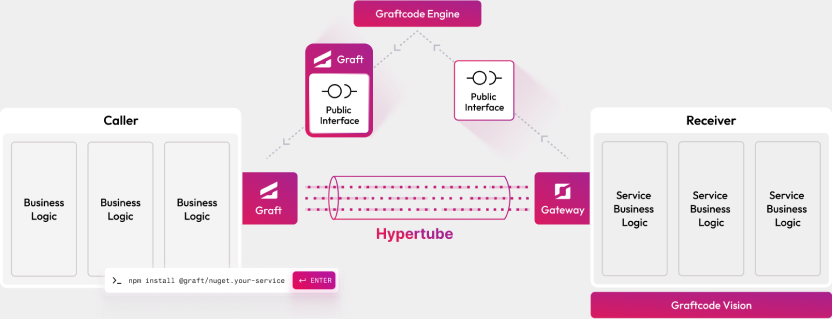
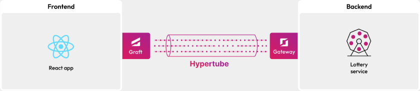

## Goal

Build two .NET classes — `Booth` (orchestrator) and `LotterySubmitter` (which calls the central **Lottery** service hosted by us). Run them as a monolith first. Then extract `LotterySubmitter` into a standalone microservice and switch between monolith and microservice with **one environment variable** — zero code changes from then on.

### Prerequisites

- [Docker](https://docs.docker.com/get-docker/) installed and running
- [.NET SDK](https://dotnet.microsoft.com/download) installed locally

## Step 1. How Graftcode works

Call remote methods like local functions. Install a package, import a method, call it directly.

With one command, Graftcode generates a strongly-typed client for your service.



*- No REST clients. No DTOs. No glue code. Just logic. -*

## Step 2. What you will build

In this challenge, you'll run Booth and LotterySubmitter as a monolith, then split one into a microservice with one config change.



*- Import methods and call them directly. No REST, no DTOs, no boilerplate. -*

## Step 3. Create the project

```bash
dotnet new classlib -n LotteryPlatform
cd LotteryPlatform
```

Delete `Class1.cs`.

## Step 4. Install the Lottery Graft

```bash
dotnet add package -s https://grft.dev/4b4e411f-60a0-4868-b8a6-46f5dee07448__free graft.nuget.lottery --version 1.0.0
```

## Step 5. Write the two classes

Create `LotterySubmitter.cs`:

```csharp
using graft.nuget.lottery;

namespace LotteryPlatform;

public class LotterySubmitter
{
    static LotterySubmitter()
    {
        GraftConfig.Host = "wss://gc-d-ca-polc-demo-ecbe-01.blackgrass-d2c29aae.polandcentral.azurecontainerapps.io/ws";
    }

    public static async Task<int> Submit(string email) =>
        await Lottery.AddTicket(email);
}
```

Create `Booth.cs`:

```csharp
namespace LotteryPlatform;

public class Booth
{
    public static async Task<string> CheckIn(string email)
    {
        var tickets = await LotterySubmitter.Submit(email);
        return $"Welcome {email}! Total tickets in pool: {tickets}";
    }
}
```

`Booth.CheckIn` calls `LotterySubmitter.Submit` directly. `LotterySubmitter` calls the central `Lottery.AddTicket` over WebSocket.

## Step 6. Host as a monolith

Create `Dockerfile`:

```dockerfile
FROM mcr.microsoft.com/dotnet/sdk:9.0
WORKDIR /usr/app
COPY . /usr/app/

RUN dotnet publish -c Release -o /usr/app/publish

RUN apt-get update && apt-get install -y wget \
 && wget -O /usr/app/gg.deb https://github.com/grft-dev/graftcode-gateway/releases/latest/download/gg_linux_amd64.deb \
 && dpkg -i /usr/app/gg.deb && rm /usr/app/gg.deb \
 && apt-get clean && rm -rf /var/lib/apt/lists/*

EXPOSE 80
EXPOSE 81

CMD ["gg", "--modules", "/usr/app/publish/LotteryPlatform.dll", "--projectKey", "YOUR_PROJECT_KEY"]
```

Build and run:

```bash
docker build --no-cache --pull -t lottery-platform-dotnet:test .
docker run -d -p 80:80 -p 81:81 --name lottery_platform lottery-platform-dotnet:test
```

Open [http://localhost:81/GV](http://localhost:81/GV) and call `Booth.CheckIn("you@example.com")`. Both classes run inside one container; the central Lottery is reached over the network.

## Step 7. Run LotterySubmitter as a standalone service

Create `Dockerfile.submitter`:

```dockerfile
FROM mcr.microsoft.com/dotnet/sdk:9.0
WORKDIR /usr/app
COPY . /usr/app/

RUN dotnet publish -c Release -o /usr/app/publish

RUN apt-get update && apt-get install -y wget \
 && wget -O /usr/app/gg.deb https://github.com/grft-dev/graftcode-gateway/releases/latest/download/gg_linux_amd64.deb \
 && dpkg -i /usr/app/gg.deb && rm /usr/app/gg.deb \
 && apt-get clean && rm -rf /var/lib/apt/lists/*

EXPOSE 90
EXPOSE 91

CMD ["gg", "--modules", "/usr/app/publish/LotteryPlatform.dll", "--httpPort", "91", "--port", "90", "--TCPServer", "--tcpPort=9092", "--projectKey", "YOUR_PROJECT_KEY"]
```

```bash
docker build --no-cache --pull -f Dockerfile.submitter -t lottery-submitter-dotnet:test .
docker network create graftcode_demo
docker run -d --network graftcode_demo -p 90:90 -p 91:91 -p 9092:9092 --name lottery_submitter lottery-submitter-dotnet:test
```

Open [http://localhost:91/GV](http://localhost:91/GV) — `LotterySubmitter` is now its own service that still talks to the central Lottery internally.

## Step 8. Connect Booth through a Graft

From [http://localhost:91/GV](http://localhost:91/GV), copy the NuGet install command for the new submitter service:

```bash
dotnet add package -s https://grft.dev/YOUR_KEY__free graft.nuget.lotterysubmitter --version 1.0.0
```

Update `Booth.cs` — the **only code change** in the entire tutorial:

```csharp
using Submitter = graft.nuget.lotterysubmitter;

namespace LotteryPlatform;

public class Booth
{
    static Booth()
    {
        Submitter.GraftConfig.SetConfig(Environment.GetEnvironmentVariable("GRAFT_CONFIG"));
    }

    public static async Task<string> CheckIn(string email)
    {
        var tickets = await Submitter.LotterySubmitter.Submit(email);
        return $"Welcome {email}! Total tickets in pool: {tickets}";
    }
}
```

From now on, topology is controlled by `GRAFT_CONFIG`.

## Step 9. Run as a microservice

```bash
docker stop lottery_platform && docker rm lottery_platform
docker build --no-cache --pull -t lottery-platform-dotnet:test .
docker run -d --network graftcode_demo \
  -e GRAFT_CONFIG="name=graft.nuget.lotterysubmitter;host=lottery_submitter:9092;runtime=dotnet;modules=/usr/app/publish" \
  -p 80:80 -p 81:81 --name lottery_platform lottery-platform-dotnet:test
```

Call `Booth.CheckIn` in Vision — same result. The chain is now Booth (container A) → LotterySubmitter (container B) → central Lottery.

## Step 10. Switch back to monolith

```bash
docker stop lottery_platform && docker rm lottery_platform
docker run -d \
  -e GRAFT_CONFIG="name=graft.nuget.lotterysubmitter;host=inMemory;runtime=dotnet;modules=/usr/app/publish" \
  -p 80:80 -p 81:81 --name lottery_platform lottery-platform-dotnet:test
```

```text
# Monolith:    host=inMemory             (LotterySubmitter runs in Booth's process)
# Microservice: host=lottery_submitter:9092  (LotterySubmitter is remote)
```

Same image, same code — just one env var. The central Lottery is always remote either way.

> Splitting `LotterySubmitter` out of the monolith is no longer a rewrite — it's one import change followed by a configuration switch.
