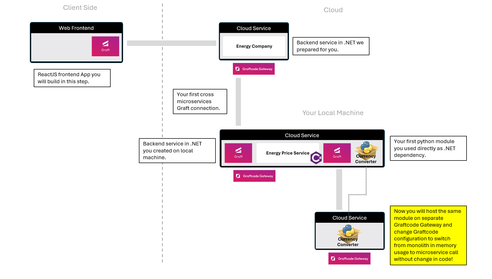
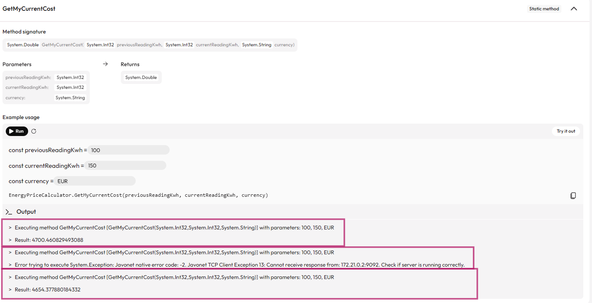

## Goal

Learn how to run the exact same service either as part of your app (monolith, in-memory) or remotely (microservice, in the cloud) - just by changing configuration.



## What You'll See

- You'll create new container that will host Currency Converter Python module with Graftcode Gateway.
- You will switch a single configuration line to connect to the same service remotely instead of using in-memory execution.
- You will see how you can switch between monolith and microservices architecture without any code changes.

## Step 1. Run Currency Converter as separate microservice

Let's create a new Dockerfile that will host the Currency Converter module and Graftcode Gateway as separate microservice on your local machine (Graftcode Gateway will just host the module and expose it as remote service).

**Return to terminal and create a new folder "PythonCurrencyService"**. Inside it create a new file named **Dockerfile** and copy and paste the content below into your Dockerfile.

```PowerShell
mkdir PythonCurrencyService
cd PythonCurrencyService
code .
```

Inside it create a new file named **Dockerfile** and copy and paste the content below into your Dockerfile.

```Dockerfile
FROM python:3.11-slim
WORKDIR /usr/app

# Install our demo sdncenter-currency-converter python module from PyPI into a local folder
RUN pip install sdncenter-currency-converter --target ./sdncenter_currency_converter 

# Install wget and download Graftcode Gateway (GG)
RUN mkdir -p /usr/app  \
    && apt-get update \
    && apt-get install -y wget \
    && wget -O /usr/app/gg.deb \
    https://github.com/grft-dev/graftcode-gateway/releases/latest/download/gg_linux_amd64.deb \
    && dpkg -i /usr/app/gg.deb \
    && rm /usr/app/gg.deb \
    && apt-get clean \ 
    && rm -rf /var/lib/apt/lists/*

# Run Graftcode Gateway pointing at that module
CMD ["gg", "--modules", "/usr/app/sdncenter_currency_converter/", "--httpPort", "91","--port","90","--TCPServer", "--tcpPort=9092"]
```


Now run the following commands to build and start the container.
This will install the Python module, download the latest Graftcode Gateway, and expose the module for remote consumption through Grafts:

```PowerShell
docker build -t pythoncurrencyservice:latest .
docker run -d -p 90:90 -p 91:91 -p 9092:9092 --name pythoncurrencyservice pythoncurrencyservice:latest
docker network create mynetwork
docker network connect mynetwork graftcode_demo
docker network connect mynetwork pythoncurrencyservice
```

Now you can visit the Graftcode Vision portal at [http://localhost:91/GV](http://localhost:91/GV#sdncenter-currency-converter/SimpleCurrencyConverter-0/convert(float,str,str)). 

You will see that the Currency Converter module is now hosted as separate microservice. You can host any other public module in the same way or extract any custom library as separate microservice by just hosting it on Graftcode Gateway in a dedicated container or anywhere else.

## Step 2. Switch your CurrencyConverter calls from monolith to microservice

Now we will switch the configuration of your **MyEnergyService** so it uses the **CurrencyConverter** module hosted in a separate container (as microservice) instead of the in-memory module running inside the monolith.

Return to the **dotnet-energy-price-service** project and run the following commands to stop the container and start it again with a new environment variable.
This variable overrides GRAFT_CONFIG and switches execution from in-memory to remote TCP communication with PythonCurrencyService.

```bash
docker stop graftcode_demo
docker rm graftcode_demo
docker run -d --network mynetwork -e GRAFT_CONFIG="name=graft.pypi.sdncenter_currency_converter;host=pythoncurrencyservice:9092;runtime=python;modules=/usr/app" -d -p 80:80 -p 81:81 --name graftcode_demo myenergyservice:test
```
Both containers are connected to the same virtual network **(mynetwork)**, so they can reach each other using container names.

As you see we just modified **host** section to use the TCP/IP connection to the new container (currently hosted on your local machine, but it can be any remote host or cloud service) instead of in-memory connection. This is the same module that we were using before but now we're connection to it over the network. 

With simple restart, your app started using this remote connection to connect to the remote module, without any change in code.

Now navigate to GraftVision portal for **EnergyService** at [http://localhost:81/GV](http://localhost:81/GV#MyEnergyService/EnergyPriceCalculator-0/GetMyCurrentCost(System.Int32,System.Int32,System.String)) and try the _GetMyCurrentCost_ method again. 

This time execution of python module **CurrencyConverter** goes over the network to your remote microservice - but your business logic code didn't change. You can dynamically switch architecture between monolith and microservices without any modification in your core logic code - just by simple configuration change.

## Step 3. Confirm that the call goes via the network to a separate service container
**Want to check if it's real?** 

Run command below to stop PythonCurrencyService and then try the **_GetMyCurrentCost_** method again:
```bash
docker stop pythoncurrencyservice
```

You will see that once the Docker container is stopped, an error appears: **"Check if server is running correctly"**.
After starting the container again, the method will return the result successfully.



> ⚡ **Important:** You service is using multiple Grafts and each of them might have its own configuration. Energy Backend keeps calling our hosted cloud service through websockets but your currency converter Graft just switched from in-memory to TCP/IP. All of this can be done through configuration files, environmental variables or from code. This allows you to dynamically change the architecture of your app without any code change.

## Step 4. Old Way vs New Way

### Old Way (without Graftcode)

Without Graftcode similar change would required number of steps:
- building new python service referencing currency service module
- implementing REST endpoints to forward every operation present on currency service module
- implementing DTOs for every argument and result object
- host this service as separate microservice
- modify code of your EnergyPrice service to call new REST endpoints
- implement DTOs and mapping for every method you planned to use
- modify your code usage to REST instead of direct method calls
- deploy your service again

### New Way (with Graftcode)

- You can host any module from public/private repository or any custom library "as is" without even preparing it for remote calls
- You can switch between monolith and microservices with just configuration change and just restart service

> ⚡ **Important:**
> With Graftcode, migrating from monolith to microservices (or back) is no longer a rewrite - it's just a configuration change.
